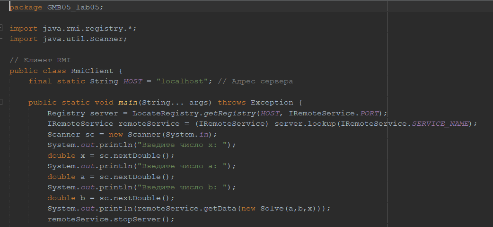
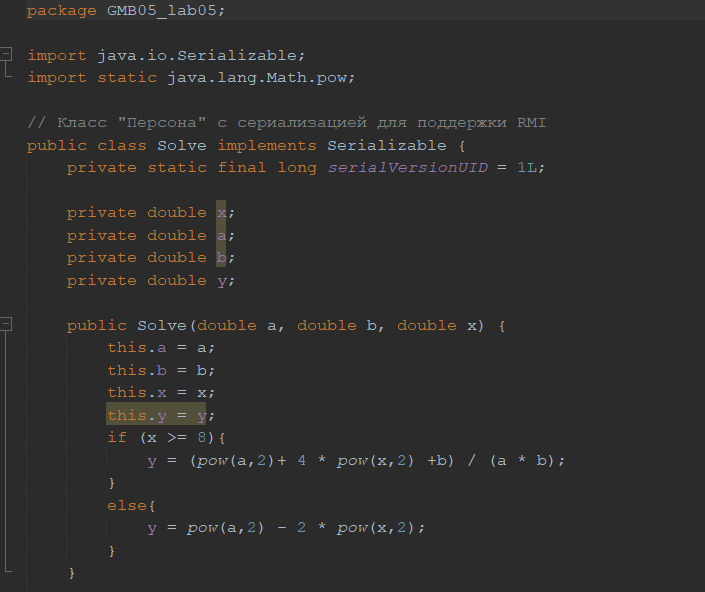

# GMB05_lab05_javaProgramming
Practical work 5. In the discipline of Java Programming





```
public Solve(double a, double b, double x) {
        this.a = a;
        this.b = b;
        this.x = x;
        this.y = y;
        if (x >= 8){
            y = (pow(a,2)+ 4 * pow(x,2) +b) / (a * b);
        }
        else{
            y = pow(a,2) - 2 * pow(x,2); 
        }
    }
```
